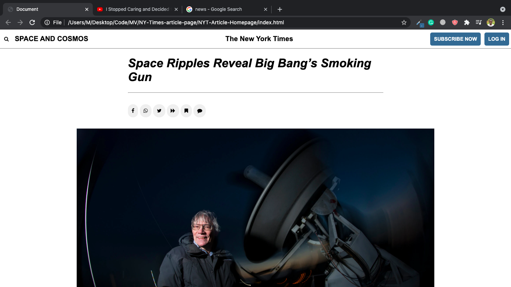

# New York Times Article Clone.

This is a clone of the New York Times Article Page (https://www.nytimes.com/2014/03/18/science/space/detection-of-waves-in-space-buttresses-landmark-theory-of-big-bang.html?_r=0)

- The goal of the project was to be able to master floating and positioning principles, mainly using Flexbox.

- The page (clone) has a navigaiton that was built with Flexbox in order to positing the elements properly.

- There is also main section that includes some images, embeded videos and some texts describing in more detail what the article is about. Care to read :)

- There is also a footer section that contains links to various pages around the Website.

- PS: The links on this page (clone) don't work. They are mainly dummy links intended for learning purposes.

## Built With

- HTML
- CSS

## Getting Started

To get a local copy up and running follow these simple example steps.

- Clone this repository onto your computer using git clone https://github.com/emmyobonyo/NYT-Article-Homepage.git

- Or you can Fork it instead, and create a pull request to suggest some changes.

### Prerequisites

- Just have a computer I guess.

## Authors

👤 **Emmanuel Obonyo**

- GitHub: [@githubhandle](https://github.com/emmyobonyo)
- Twitter: [@twitterhandle](https://twitter.com/emmyobonyo)
- LinkedIn: [LinkedIn](https://www.linkedin.com/in/emmanuel-obonyo-3728a2200/)

## 🤝 Contributing

Contributions, issues, and feature requests are welcome!

Feel free to check the [issues page](https://github.com/emmyobonyo/NYT-Article-Homepage/issues).

## Show your support

Give a ⭐️ if you like this project!

## Acknowledgments

- [Microverse](https://www.microverse.org) for providing the linters and README file
- Thanks to [Teddy Livingstone](https://github.com/TedLivist) for helping me when I got stuck

## 📝 License

This project is [MIT](lic.url) licensed.
